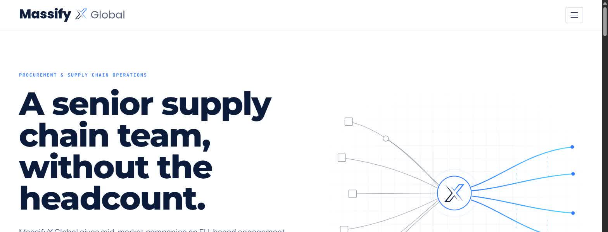
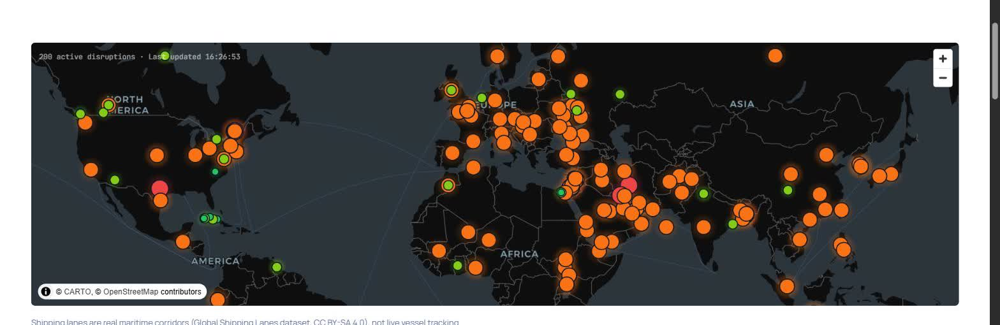
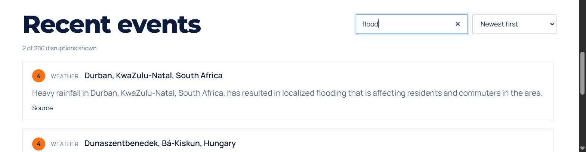
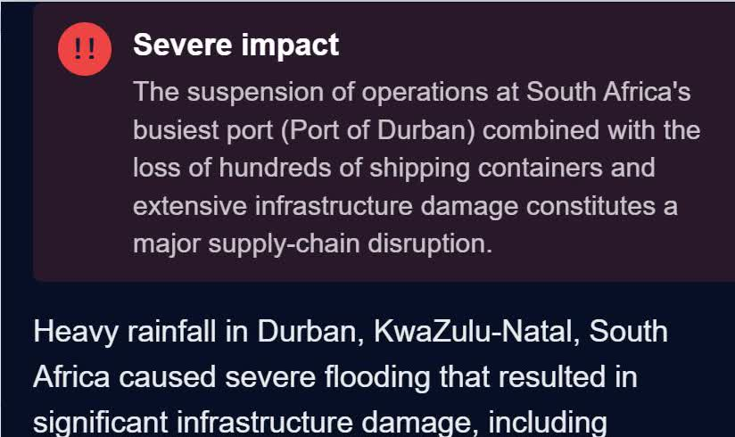
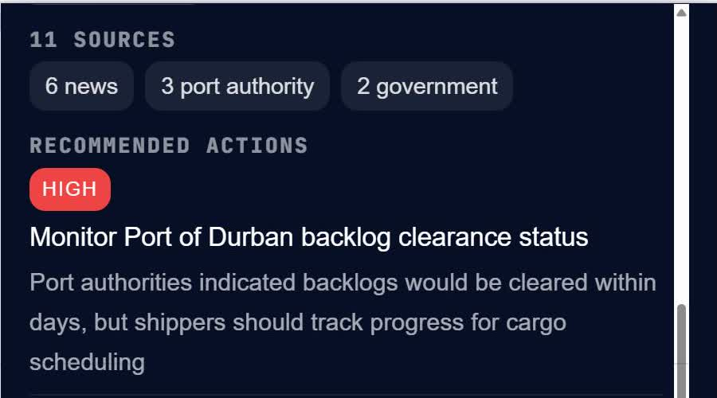

# NORVENZIA — Website

Procurement and supply chain operations for mid-market companies: an EU-based
engagement point in Sweden paired with senior-led delivery from Sri Lanka.

Plain Node.js. No build step, no bundler, no CSS framework. Edit a file, restart, done.



**Intelligence pages** — `/live`'s global disruption map, feed search/sort, and the
War Room AI-investigation feature (see "Intelligence" below), all real screenshots
of the running site:

| | |
|---|---|
|  |  |
|  |  |

## Run it

```bash
npm install
cp .env.example .env    # then set ADMIN_PASSWORD and SESSION_SECRET
npm run dev             # node --watch, restarts on save
```

Generate the two secrets with:

```bash
node -e "console.log('ADMIN_PASSWORD=' + require('crypto').randomBytes(12).toString('base64url'))"
node -e "console.log('SESSION_SECRET=' + require('crypto').randomBytes(32).toString('hex'))"
```

Both scripts read `.env` automatically, and start fine without it (with a warning —
the public site works, `/admin` stays locked). Production: `npm start`.

**Full deployment guide, including Hostinger: [`deploy/README.md`](deploy/README.md).**

| Variable | Required? | Effect |
| --- | --- | --- |
| `PORT` | Optional | Listen port (default 3000) |
| `ADMIN_PASSWORD` | Required for `/admin` | Without it, every login is refused by design |
| `SESSION_SECRET` | Recommended | Keeps admin sessions alive across restarts |
| `NODE_ENV=production` | Recommended | Secure cookies, static-asset caching |
| `BASE_URL` | Recommended | Canonical URLs, Open Graph tags, sitemap |
| `MIS_BASE_URL` | Optional | Address of the [Norvenzia Intelligence Service](https://github.com/Viraj97-SL/massifyx-intelligence) — see below |
| `WARROOM_BASE_URL` | Optional | Address of the War Room investigation service — see below |
| `WARROOM_ACCESS_CODE` | Required to unlock War Room | Shared code that unlocks `/live`'s "Investigate" action for a session. Without it, every unlock attempt is refused by design |

Unset or unreachable `MIS_BASE_URL` is not an error — `/live` degrades to a
"temporarily unavailable" panel and still returns 200.
`/insights/sweden-trade` needs no env var at all; it renders entirely from
the committed `content/sweden-trade-data.json` (see **Intelligence** below).

## Layout

```
server.js               Express app — routes, contact validation, sitemap/robots
content/                Default copy as plain JS modules — the site's substance
content/sweden-trade-data.json  Pre-baked Statistics Sweden dataset (see Intelligence below)
lib/                    store (merge), schema (fields + write allow-list), auth, paths
routes/admin.js         All /admin routes
scripts/sweden-trade/   Offline job that produces content/sweden-trade-data.json
views/                  EJS templates + partials
public/                 CSS, vanilla JS, self-hosted fonts/libraries, brand assets
data/                   git-ignored — admin overrides and backups
```

Copy lives in `content/*.js`. `lib/store.js` merges JSON overrides written by the
admin panel over those defaults at read time, so admin edits appear live with no
restart. A missing or corrupt `data/content.json` can never take the site down — it
falls back to the shipped copy.

## Editing content

Two ways:

1. **`/admin`** — password-protected panel, edits every word on the site. Changes go
   live immediately. Backups are taken before every save; "reset to original" is
   always available.
2. **`content/*.js`** — edit the shipped defaults directly and restart.

## Intelligence

Two pages under the "Intelligence" nav item, both designed so a down or
missing upstream never takes the marketing site with it:

- **`/live` — Global Disruption Monitor.** Server-side proxies
  [Norvenzia Intelligence Service](https://github.com/Viraj97-SL/massifyx-intelligence)
  (`MIS_BASE_URL`) for live supply-chain disruption events; the browser
  never learns MIS's real address (`GET /live/data` is a same-origin
  proxy). The map is MapLibre GL JS (self-hosted, CSP-safe build) on
  CARTO's free dark-matter vector basemap — a named CSP exception for
  `*.basemaps.cartocdn.com` (`server.js`), the only origin exception on
  the whole site. Shipping lanes drawn on it are real, static maritime
  geography (`public/geo/shipping-lanes.geojson`, sourced from the
  [Global Shipping Lanes dataset](https://doi.org/10.5281/zenodo.6361763),
  CC BY-SA 4.0 — see `public/geo/README.md`), not generated or
  illustrative paths. If MIS is unset, down, or slow, `/live` still
  returns 200 with a "temporarily unavailable" panel.
- **War Room — gated incident investigation.** An "Investigate" action in
  `/live`'s event popup that proxies to a third, separate microservice
  (`WARROOM_BASE_URL`) which researches a single clicked disruption and
  returns a structured affected/unaffected/recommended-actions briefing,
  every claim cited to a real source. Gated, not public: anonymous visitors
  see a locked teaser with a "Request access" link into `/contact`
  (identifiable via `?topic=warroom`) and, if a booking URL is configured,
  a "Schedule a demo" link. `WARROOM_ACCESS_CODE` (same shape as
  `ADMIN_PASSWORD`) unlocks it for a browser session via `POST
  /live/unlock`. Investigations run server-side only — the browser never
  learns War Room's address, and an unset/unreachable/failed/capped job all
  degrade to a clear "unavailable" state, never a broken page. See
  `docs/internal/WARROOM_BUILD_PLAN.md` and `WARROOM_API_CONTRACT.md`.
  - The result itself is a structured panel, not a flat paragraph: a
    colored impact badge (`impactLevel` — none/low/moderate/severe, the
    investigation's own verdict, distinct from the incident's input
    severity), a collapsed-by-default at-a-glance count strip per affected
    category, a sources panel (source-type breakdown, computed client-side
    from the citations already in the response), an investigation
    metadata line (cost/depth/elapsed time), and up to 3 related-incident
    chips surfaced from the same semantic-similarity check the service
    uses for its own cost-saving dedupe cache.
  - Since the "Investigate" action only lives inside a clicked event's
    popup, `/live` also has a standalone explainer section below the map
    (visible to every visitor, locked or unlocked) describing the
    capability and previewing the real result-panel styling with static,
    labeled-illustrative example content — not a screenshot or stock
    photography, the product's own actual UI classes rendered with sample
    data (see `views/live.ejs`'s War Room explainer section and
    `public/css/styles.css` section 30).
- **`/insights/sweden-trade` — Sweden Trade Intelligence.** A
  scrollytelling data story analysing Sweden's trade (imports/exports by
  goods category, partner country, concentration risk, balance, YoY
  trend), sourced from Statistics Sweden's key-free PxWebApi v2. Static
  by design — SCB updates monthly, so the site has **zero runtime
  dependency on SCB**. `scripts/sweden-trade/` is the offline job that
  produces the committed `content/sweden-trade-data.json`:
  ```bash
  npm run data:sweden-trade        # re-run the pipeline, overwrite the dataset
  npm run test:sweden-trade        # unit tests for the pipeline (separate from npm test)
  ```
  The job fails loudly (non-zero exit, dataset untouched) on any
  data-integrity violation — see `scripts/sweden-trade/RUNBOOK.md`.
  A GitHub Action (`.github/workflows/sweden-trade-refresh.yml`) reruns it
  monthly and opens a PR with the diff rather than pushing to `main`.
  Charts are self-hosted D3 v7 (`public/js/vendor/d3.v7.min.js`) with a
  hand-rolled scroll-position stepper (`public/js/story-engine.js`) — no
  CDN, no new CSP exceptions. The page is fully readable with JavaScript
  disabled; JS only upgrades it to the sticky-scroll experience.

## Honesty constraints

These are structural, not a writing style to remember:

- No client names, logos, testimonials, case studies, or "trusted by" bars.
- No headcount, years-in-business, or invented performance metrics.
- Every product and division claim is labelled **Live today** or **Roadmap**, rendered
  through a single partial (`views/partials/badge.ejs`).
- ISO 27001 and SOC 2 are named on *How We Work* explicitly as **not** held today.
- No public pricing — tiers route to "Contact us".
- No photography. The illustrative graphics are brand-native SVG (see below).

## Design

Light-only, editorial register. Navy `#0a1b3c` is the dominant brand presence; cobalt
`#2e7bff` and cyan `#46d3ff` are signal only — buttons, links, eyebrows, hairline
accents, diagram strokes — never large fills or backgrounds.

Fonts (Montserrat, Manrope, JetBrains Mono) are self-hosted as variable WOFF2, latin
subset only, ~101 KB total. Not the Google Fonts CDN: a German court held that
embedding it transmits visitor IPs to a third country without consent, which is a real
exposure for a site targeting German buyers.

### Artwork

All illustrative graphics are self-contained, animated SVG in the brand palette —
no photography, no stock icon set, no external requests:

- `views/partials/hero-figure.ejs` — the hero diagram: fragmented supplier inputs
  converging through one control point, leaving as ordered connected lanes.
- `views/partials/industry-icon.ejs` — eight bespoke line icons, keyed by slug.
- `public/img/motion/supply-flow.svg` — full-bleed animated band on the home page.
- `public/img/industries/*.svg` — one composition per vertical.
- `public/img/regions/*.svg` — Sweden and Sri Lanka, drawn from real coordinates
  with the engagement point and delivery hub pinned.

Each animates via internal CSS and stops under `prefers-reduced-motion: reduce`.
Every image path is an editable field in the admin panel, so any of these can be
swapped for a different asset without touching code.

## Progressive enhancement

The site works fully with JavaScript disabled: every route renders, every link works,
and the contact form validates and submits server-side. JS only adds the mobile menu,
scroll reveals, and the cookie banner.

Scroll-reveal is gated on a `.js` class set by `public/js/js-on.js` (a tiny external
head script — the CSP forbids inline scripts), so with JS off content is simply
visible rather than stuck at `opacity: 0`. A 2-second failsafe also reveals everything
unconditionally in case the IntersectionObserver misses an element.

## Security

- Helmet CSP: `script-src 'self'`, no inline scripts anywhere. `frame-src` is
  evaluated per request against the live booking URL, so adding a Calendly link in the
  admin panel widens the policy with no restart. The one standing origin exception is
  `connect-src`/`img-src` for `/live`'s CARTO basemap tiles (`*.basemaps.cartocdn.com`)
  — named and minimal, not a blanket relaxation.
- Admin: one shared password via `ADMIN_PASSWORD`, SHA-256 + `timingSafeEqual`
  comparison, session regeneration on login, per-session CSRF on every POST, and a
  15-minute lockout after 6 failed attempts from one IP.
- War Room: one shared access code via `WARROOM_ACCESS_CODE`, same
  SHA-256 + `timingSafeEqual` comparison and 15-minute/6-attempt lockout
  discipline as admin, gating a session flag rather than a login (`lib/warroomAuth.js`).
- The schema doubles as a write allow-list — a crafted POST can only reach declared paths.
- Uploads: JPG/PNG/WebP only by MIME type, 4 MB cap, 4 per request, filenames always
  replaced with random hex.
- `/admin` sets `X-Robots-Tag: noindex`; `robots.txt` disallows it; the sitemap is
  built from a hard-coded public route list, so `/admin` is absent by construction.

## Hosting

Standard Node web service, no build step. The one decision that matters: admin edits
live in `data/content.json` and uploads in `public/img/uploads/`. Hosts that give each
deploy a fresh filesystem silently discard both on redeploy. Either attach a
persistent disk, treat the admin panel as edit-locally-then-commit, or export a JSON
copy before every redeploy. If the site is only ever edited via `content/*.js` in
code, none of this applies. `content/sweden-trade-data.json` is unaffected either
way — it's a committed file in git, refreshed by a scheduled job (see
**Intelligence** above), not written at runtime.

## Outstanding founder TODOs

Grep for `TODO(founder)`, or work the admin dashboard's checklist top to bottom:

- [ ] Wire contact-form delivery to a real inbox or CRM webhook (currently logged to stdout).
- [ ] Add a booking embed URL (Calendly or equivalent).
- [ ] Upload a founder headshot.
- [ ] Rewrite the founder story on *Who We Are* in the founder's own first-person words.
- [ ] Have counsel review Privacy, Cookie, and Terms; confirm the Terms' governing-law jurisdiction.
- [ ] Confirm the exact Sweden engagement-point framing and registered-company wording.
- [ ] Choose a cookieless analytics tool and wire it behind the existing consent gate.
